# Projeto: Explorando Dados Demográficos com Serviços de Big Data na AWS

## Autor: Jeremias Diefenthaler (reproduzindo passos do Professor)

### Aula: Imersão Cloud Computer
### Professor: Cassiano Peres
#### Tecnologia: Amazon S3, Amazon Glue, Amazon Athena e Amazon QuickSight
#### Data: 10/11/2022
-----------------------------------------

## Objetivos do desafio:

- Vamos explorar o poder do SQL em uma ferramenta de BigData totalmente gerenciada na AWS, o Amazon Athena. Para isso, o expert apresenta na prática esse serviço de consultas interativas que facilita a análise de dados no Amazon S3 usando SQL padrão.
- Neste desafio, você irá aprender ao mesmo tempo que desenvolve algo prático para o seu portfólio! Sendo assim, as seguintes tarefas serão realizadas:
    - Criar bucket no Amazon S3;
    - Criar Glue Crawler;
    - Criar aplicação no Amazon Athena;
    - Criar tabelas;
    - Eliminar recursos;
    - Visualizar dados no Amazon QuickSight.

----------------------------------------------

## Importante: este desafio foi reproduzido através do repositório disponibilizado pelo Professor, que pode ser acessado pelo link abaixo:

<https://github.com/cassianobrexbit/dio-live-athena>

----------------------------------------------

### Etapas para o desenvolvimento:

### Criar bucket no Amazon S3

- Amazon S3 Console -> Buckets -> Create bucket -> Bucket name [nome_do bucket] - Create bucket
- Create folder (Criar uma pasta chamada ```/output``` e outra com o nome do seu conjunto de dados. Este nome irá definir o nome da tabela criada no Glue)

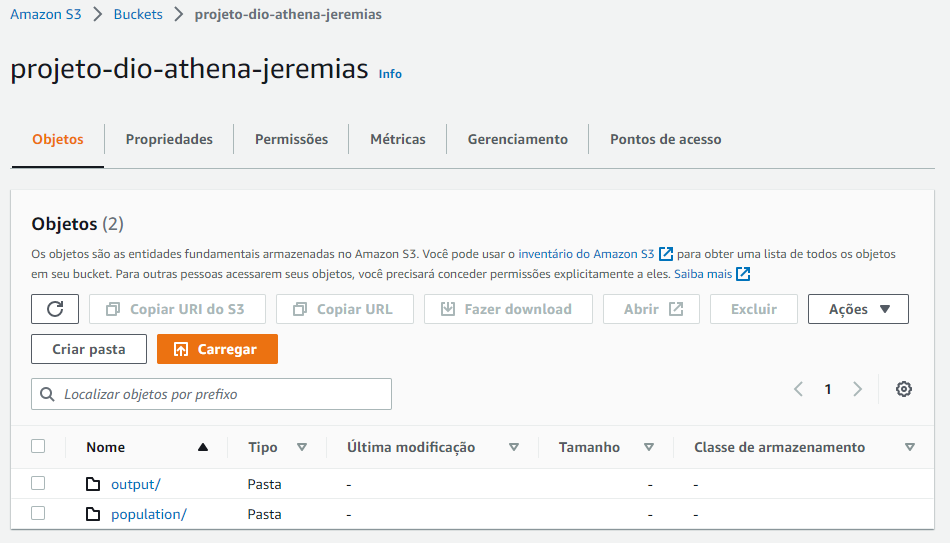

- Upload dos arquivos de dados localizados na pasta ```/data```

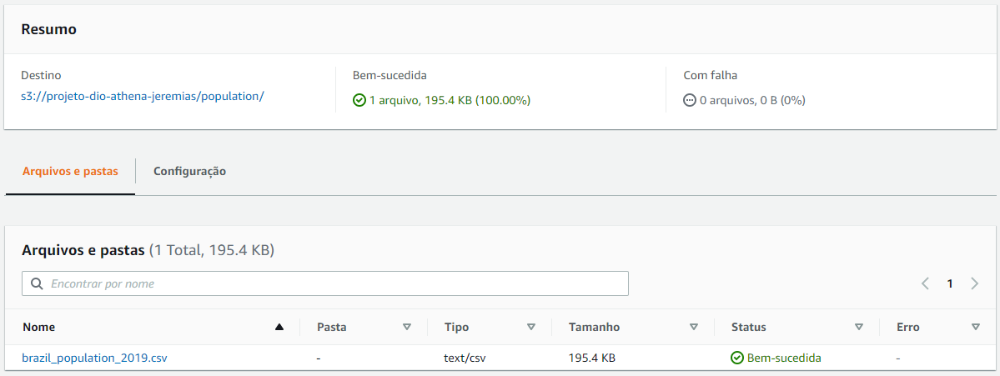


#### Criar Glue Crawler

- Amazon Glue Console -> Crawlers -> Add Crawler
- Source type [Data Stores] -> Crawl all folders
- Data store [S3] -> Include path [caminho do diretório dos dados de entrada]
- Create IAM Role
- Frequency [Run on demand]
- Database name [seu_nome_de_db]
- Group behavior [Create a single schema for each S3 path]
- Finish

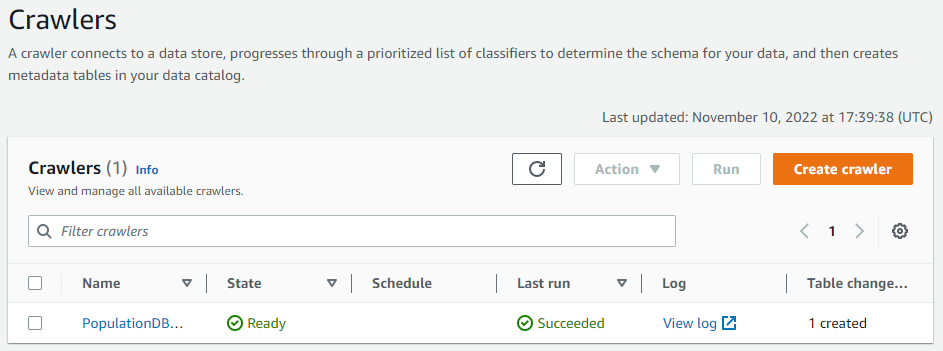

- Databases -> Tables -> Visualizar dados das tabelas criadas

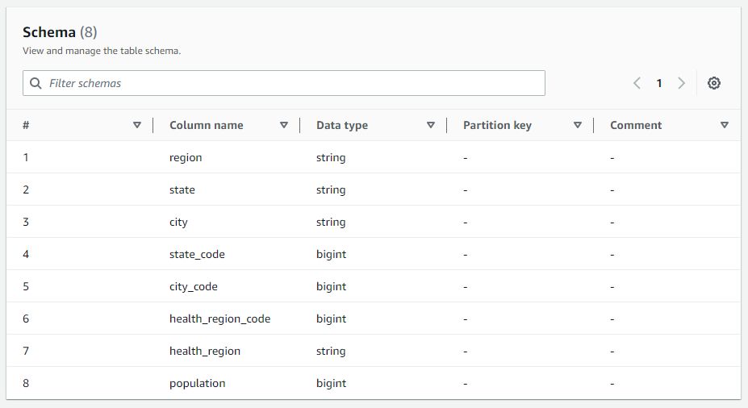


### Criar aplicação no Amazon Athena

- Query editor -> Settings -> Manage settings -> Query result location and encryption -> Browse S3 -> selecionar o bucket criado
- Selecionar Database -> criar queries

> Querys executadas:

```
select
    sum(population)
from "populationdb"."population";
```
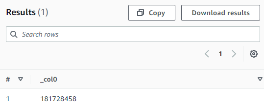

```
select 
    city, 
    population
from "populationdb"."population"
where city='Porto Alegre';
```
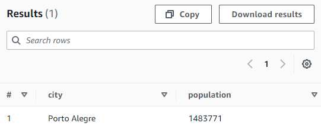

```
select 
    region,
    sum(population)
from "populationdb"."population"
where region='Sul'
group by region;

select 
    state,
    sum(population)
from "populationdb"."population"
where state='Rio Grande do Sul'
group by state;
```
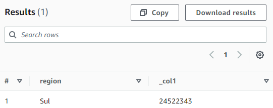
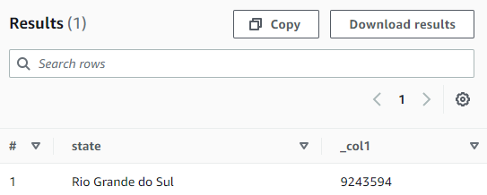

- Verificar queries não salvas no bucket criado no S3
- Salavar queries -> Executar novamente -> Verificar no bucket criado no S3


#### Criando nova tabela

- Generate table DDL
- Copiar a query gerada
- Selecionar o DB e criar a nova tabela em uma nova query


### Visualizar dados no Amazon QuickSight

- Signup (caso não tenha conta) -> Escolher [Standard]
- Datasets -> Create new dataset -> Athena -> Name [NomeDoDataSet] -> Create
- Select database -> select table -> Edit or preview -> Save & visualize
- Criar visualizações selecionando colunas, criando filtros e parâmetros e selecionando Visual types para gráficos.

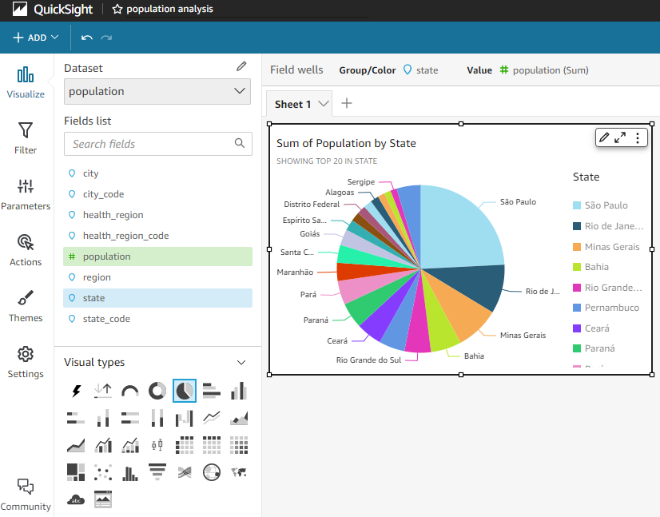

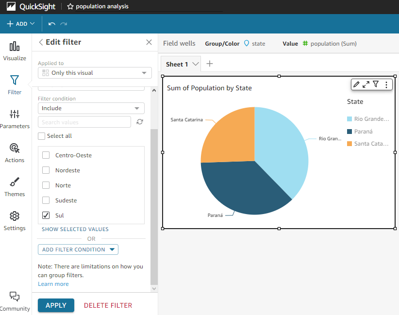

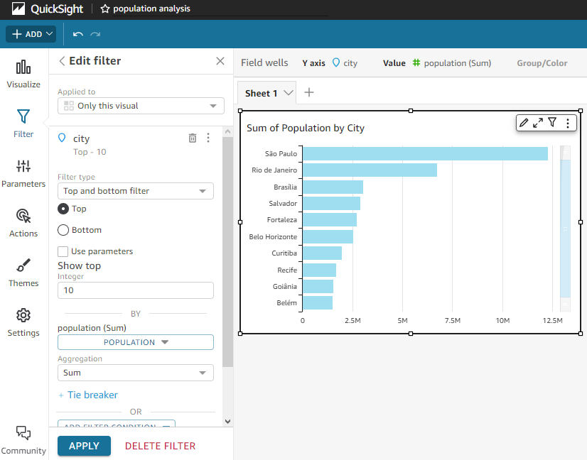


### Eliminar recursos
 - Exluir os elementos criados

